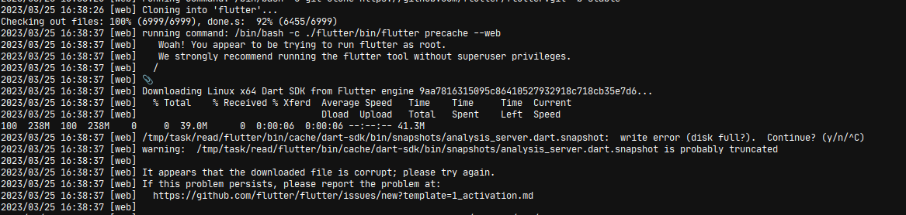

# flutter on space

A sample demo / working Spacefile to deploy Flutter Web project on Deta Space.

This is not yet working ~~

## Structure

### Why a `package.json` ?

`static` engine's `run` commands detects `package.json` file for it to execute, it is a hack (not yet tested) to make the space cli think its a node project
